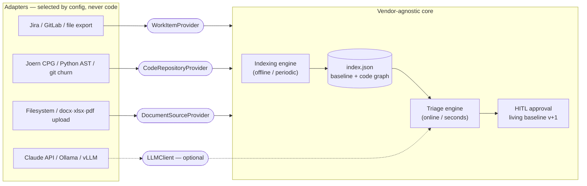

# Etki

**The only open-source tool that answers *"is this in scope?"* with contract evidence, code impact and historical effort — support for analysts, leverage in client negotiations.**

  


> ⚠️ **Alpha.** APIs, schema and screens may change. Not for production; intended for pilot/evaluation.

Etki is a **decision-support application for software teams** — analysts, developers and the PMO alike — that answers a single question for every incoming client request:
**Is this in-scope, out-of-scope, or a Change Request (CR); what is the effort; which code and which contract clause does it touch?**

Its defensible value is producing a **live, evidence-backed recommendation** from the **fusion of three sources** — it doesn't leave the analyst alone, and it strengthens your hand with evidence in client negotiations:

1. **Contract scope** — clauses extracted into structured `ScopeItem`s (including the explicitly *excluded* ones).
2. **Code knowledge graph** — modules, dependencies, complexity, churn — for impact analysis and effort.
3. **Historical effort** — real time logged on similar past requests, used by analogy.

Every decision carries an **auditable evidence chain** (clauses checked, best match, impacted modules, reasoning, confidence, model/version and index-freshness stamp) — it can be reconstructed for a contractual dispute. **Copilot, not autopilot:** the system *recommends*, a **human makes the final call**.

## Try it in 5 minutes — no API key

One command starts a fully seeded **English demo** (sample contract + code repo + past work items). No LLM key, no JVM, no Postgres — the decision path is fully deterministic:

```bash
docker compose -f docker-compose.demo.yml up --build
```

Open http://localhost:8000, log in as `demo` / `demo` (hard-coded for local evaluation only), open the **Meridian CRM (demo)** project → **Triage**, and try:

- *"We need SAML single sign-on with our corporate identity provider"* → **out of scope**, citing the explicit exclusion (Clause 7.1), with the effort such a CR would take — estimated from similar past tickets.
- *"Add a date filter to the monthly standard report"* → **in scope** (Clause 4.2.1), impacted modules, and an effort range by analogy.

Every answer shows its full evidence chain: the contract clauses checked, the best match and score, the impacted code modules, and the index-freshness stamp.

## What it does

- **Triage** — enter a request → in-scope / out-of-scope / CR / gray-area / maintenance decision + an **effort range** (single-point estimates forbidden) + risk + impacted-module cards.
- **Automatic pre-analysis** — after triage, a developer-oriented technical pre-analysis is generated automatically (LLM if available, otherwise deterministically from the evidence chain) and saved to the case; it can be edited and enriched via chat.
- **Approval & living baseline** — the reviewer approves / rejects / converts to CR; an approved CR bumps the baseline version by +1. A **baseline timeline** shows which CR added which clause, when; the history screen filters by decision type, and approved cases live there as **analyses**.
- **Ask (Sor)** — a single-input question box over the project's knowledge graph: an instant **deterministic answer** (scope clauses, modules, dependencies — source-labeled) and, if an LLM is configured, an AI answer **grounded in that deterministic result**. Every question and answer is appended to the project's process log.
- **Flow map (Sankey)** — **Request → Requirement (scope clause) → Code module** interaction; interactive, with node detail. Each triage also has its own flow graph.
- **Explorable index** — a per-clause detail screen (rulings, memory and pool status per scope item), a per-module code-graph table (repo-scoped), a dependency card with version-compare / OSV lookup, and an index-run history with freshness badges.
- **Document management** — upload Word/Excel/PDF/CSV (→ text + scope clauses), preview documents inline; attach code repos (git URL / local) and work-item trackers (Jira/GitLab/Redmine/Azure DevOps/Linear/file).
- **Reports** — KPI/scorecard on the project summary (over-reliance rate, agreement, effort pool with per-item consumption breakdown, precedent & disputed-clause counters); every KPI tile links to the list that answers "which ones?", and a client-ready `.docx` report per case.
- **Decision memory ("decision memory as code")** — every triage decision is auto-projected to a per-project, git-versionable **markdown wiki** (`decisions/`, entity backlinks, generated index). Human overrides are promoted to **precedents**, conflicting rulings on the same clause surface in a **disputed** page, and a `GraphQueryPort` retrieves over scope clauses + code modules + past work items (top-k / graph expand / guarded NL query). The wiki is always a **projection of the database** — regenerable with one command, never a second source of truth.
- **Multilingual UI (TR/EN/DE)** — switch language from the top-right; menus/labels and LLM output follow the chosen language.
- **Per-project LLM profile** — assign each project an **output language** (any language) + a selectable **domain/skill profile** (`config/domains/*.md`: integration, enterprise, e-commerce, healthcare…) or free-text instructions; LLM prompts are enriched per project. An optional **pivot translation** (translate input → working language → reason → translate back) can be enabled per project.
- **Settings screen (pmo)** — the global LLM provider (off / Anthropic / OpenAI-compatible) is configured **from the UI** with a one-click connection test, and **users are managed from the UI** too: create/delete, roles, per-user project grants, password reset.

Multi-project, multilingual UI, session/login + role-based authorization: approval = `pmo`, `engineer` runs triage/analysis, `viewer` is **read-only**; project access via per-user grants. Sessions are hardened (login rate limiting, remember-me lifetimes, password reset drops live sessions). Decisions surface **effort ranges only** (monetary cost was removed).

**How matching works today (honestly):** the request↔contract matching is layered, and every layer is measured on a public benchmark (see EtkiBench below):

1. **Deterministic lexical matching** (always on) — tokenization with a Turkish↔English domain-term bridge, prefix-based inflection tolerance, bilingual stopword/boilerplate filtering and a symmetric-normalized overlap score. Fully reproducible; scores 62% on the benchmark.
2. **Deterministic semantic evidence** (optional, local embeddings via Ollama/vLLM) — an `EmbeddingProvider` port. We *measured* that cosine similarity cannot tell "a paraphrase of a clause" from "a new capability near a clause" (0.629 vs 0.630 on the benchmark), so by design the embedding layer only routes **clear exclusion matches** and otherwise adds an informational "semantically nearest clause" note — it never fabricates an in-scope call.
3. **Guarded LLM assist** (optional, off by default) — consulted only when the deterministic match is weak; strength-gated, whitelist-validated, anti-hallucination prompt rules. This is where the paraphrase judgment lives: it lifts the benchmark score to 88% with a local **20B** model (94% together with the cross-encoder reranker lane) — and to be blunt, an *unguarded* small model made results worse, which is exactly why the guards exist.

## How it compares

Software-engineering-intelligence platforms measure *delivery*; estimation plugins guess *effort*. Neither can defend a **scope decision** against a contract. That fusion is Etki's whole job:

| | **Etki** | SEI platforms (LinearB, Jellyfish…) | Jira estimation plugins |
|---|---|---|---|
| Core question | *"Is this request in scope, and what effort would it take?"* | *"How is delivery performing?"* | *"How many points/hours?"* |
| Contract scope as data (incl. **excluded** clauses) | ✅ first-class | ❌ | ❌ |
| Code knowledge graph for impact analysis | ✅ Joern CPG / Python AST | partial (repo metrics) | ❌ |
| Per-decision evidence chain (clauses, match score, modules, model + index stamp) | ✅ reconstructable for disputes | ❌ | ❌ |
| Estimates | ranges only (three-point/PERT) | n/a | typically single points |
| Human-in-the-loop | built in — a human decides, overrides are tracked | n/a | n/a |
| Deployment | self-hosted, air-gapped capable | SaaS | marketplace app |
| License | Apache-2.0 | commercial | commercial |

## EtkiBench — a public benchmark for scope triage

Nothing else measures the scope decision itself, so we ship the benchmark: **66
stratified cases** (paraphrases, adversarial exclusions, limit/quota and effort-pool
CRs, cross-lingual TR↔EN) anchored to the bundled corpus, every label argued from the
contract with a clause-citing rationale. One command reproduces any row; models are
scored in the production configuration (assist-on-weak-match, whitelist-validated).

| Mode (2026-07, English prompts) | Agreement |
|---|---|
| gpt-oss:20b + cross-encoder reranker (local) | **94%** |
| gpt-oss:20b / gemma3:27b (local, Ollama) | **88%** |
| gpt-oss:120b (local, Ollama) | 85% |
| Deterministic + reranker (no LLM at all) | 80% |
| Deterministic (no assists) | 68% |

The answer keys are protected by a CI **freeze guard** (engine changes and dataset
edits cannot land together), and improvements are validated on **pre-registered,
one-shot held-out sets** — the methodology, the full scoreboard, and the honest
negative findings live in
[`eval/datasets/etkibench/`](eval/datasets/etkibench/README.md).

## Quick start

```bash
uv sync --dev                                   # venv + dependencies (editable install)
cp .env.example .env                            # fill in settings (LLM optional)
uv run python -m etki.persistence create-user   # first admin user (or ETKI_ADMIN_*)
uv run uvicorn etki.api.app:app --reload   # http://localhost:8000  (API docs: /docs)
```

Only the *first* admin user needs the CLI/env bootstrap — after logging in, manage users
(roles, project grants, password resets) from **Settings → Users** in the UI.

The LLM is **optional** — with no API key the system runs deterministically/heuristically.
The easiest way to enable it is **Settings → AI Assistant** in the UI (pmo-only): pick the
provider, paste the key/endpoint, hit *Test connection*. Values saved there live in
`.etki/llm.json` (owner-readable only, git-ignored) and take precedence over env vars.
For production prefer `.env`:

```bash
ETKI_LLM_PROVIDER=anthropic
ETKI_ANTHROPIC_API_KEY=sk-ant-...          # Anthropic Claude API key
# ETKI_DEFAULT_LANGUAGE=tr                 # default UI language (tr|en|de); overridden by session/Accept-Language
```

### Fully air-gapped mode

The data Etki handles — client contracts, code, effort history — is exactly the kind that can't leave your network. Every layer has a local option, including the LLM (one OpenAI-compatible adapter covers Ollama, vLLM, LM Studio, llama.cpp server):

```bash
ETKI_LLM_BASE_URL=http://localhost:11434/v1   # Ollama endpoint (enables the local provider)
ETKI_LLM_MODEL=qwen2.5:3b                     # any model your server hosts
ETKI_EMBED_BASE_URL=http://localhost:11434/v1 # optional: local semantic evidence
ETKI_EMBED_MODEL=qwen3-embedding:0.6b         # (deterministic per model — reproducible)
```

Local LLM + `ast` code engine + SQLite = **zero external dependencies** (the UI vendors its own assets — no CDN). And with no LLM configured at all, triage is fully deterministic and reproducible.

### Common commands

```bash
uv run pytest                                   # all tests (no Joern/JVM needed; uses fakes/AST)
uv run ruff check . && uv run mypy etki    # lint + type check
uv run python -m eval.runner                    # CI gate: retrieval + decision-agreement backtest
uv run python -m eval.runner --dataset my.json  # benchmark YOUR labeled cases (add --llm to score a model)
uv run python -m etki.indexing [project_id]  # rebuild the index (live Joern; AST alternative)
uv run python -m etki.mcp_server           # MCP server: triage_request + 4 index tools —
                                                #   ask Claude "is this in scope?" (see docs/MCP.md)
docker compose up -d --build                    # app + Postgres (ast engine → JVM-free container)
```

## Architecture (the load-bearing decisions)

- **Hexagonal (ports & adapters)** — the core is vendor-agnostic. Three abstract ports: `WorkItemProvider`, `CodeRepositoryProvider`, `DocumentSourceProvider`. Adding a new system = writing a new adapter (Jira/GitLab/GitHub/FileSystem/SharePoint…). **Which adapter is active is configuration, not code.**
- **Two cadences** — *Indexing* is offline/periodic (code → graph, contract → baseline); *Triage* is online and answers in seconds by querying the pre-built index.
- **EXCLUDED scope is first-class** — `ScopeItem.polarity = INCLUDED | EXCLUDED`. A match against an excluded clause is the highest-confidence "out-of-scope".
- **Two-evidence rule** — a decision rests on both (a) text similarity (request ↔ contract) and (b) code reality; conflict → gray area → escalate to PMO.
- **Estimates are always ranges** (cone of uncertainty); three-point/PERT.



The LLM is abstracted behind a single `LLMClient` port with two providers: the **Anthropic Claude API** (`anthropic` SDK; default model `claude-opus-4-8`) or any **OpenAI-compatible endpoint** (Ollama, vLLM — see air-gapped mode above). The LLM is **optional** — with no key the system runs deterministically/heuristically. The code graph is produced by **Joern** (CPG) or the dependency-free **Python `ast`** path (same normalized schema). Persistence is SQLite (default/test) or Postgres (Docker).

```
etki/
  core/        domain models (Pydantic) + ports (Protocol) — vendor-agnostic
  adapters/    registry (config→adapter) + fakes + filesystem/jira/gitlab/joern/ast/git/llm…
  extraction/  scope_extractor (contract → ScopeItem[]) + parsers (docx/xlsx/pdf → text)
  indexing/    IndexingEngine + scope↔code mapping + save/load
  engine/      triage (decision tree) + understanding + estimation (PERT)
  hitl/        ApprovalService (approve/reject/CR + living baseline) + ingest (feedback → precedents/disputed)
  persistence/ CaseFileRepository port (SQL / in-memory)
  wiki/        decision-wiki CLI (search/show/rebuild) — the wiki is a DB projection
  i18n/        multilingual catalog (tr/en/de) + t()/resolve_locale
  api/         app (JSON API) + web (HTMX UI) + context + security (login/RBAC) + templates/
  kpi.py · graphquery.py · mcp_server.py · agent.py · projects_store.py · config.py
  domains.py · llm_profile.py   # per-project domain profile + LLM prompt prefix
config/ (connectors + domains/*.md) · samples/ · docs/ · tests/ · eval/ · Dockerfile · docker-compose.yml
```

The two design documents are the source of truth for the full vision:
[`Etki_Mimari_Dokuman.md`](Etki_Mimari_Dokuman.md) (architecture) and
[`Etki_Gelistirme_Plani.md`](Etki_Gelistirme_Plani.md) (development plan).
Operations/compliance: [`docs/RUNBOOK.md`](docs/RUNBOOK.md) · [`docs/KVKK.md`](docs/KVKK.md) (Turkish — KDPL/KVKK compliance notes) · [`docs/MCP.md`](docs/MCP.md) (use Etki from Claude via MCP) · [`docs/writing-an-adapter.md`](docs/writing-an-adapter.md) (add your tracker/repo/doc source — in-tree, or as a standalone plugin package against [`etki-api`](https://pypi.org/project/etki-api/)).

## Status

Phases 0–4 are implemented (walking skeleton → data backbone → decision brain → HITL/audit/UI → pilot), plus a hardening pass (baseline rehydration from the DB, per-project access isolation, prompt-injection guards, a frozen 66-case golden eval set with Wilson intervals) and a benchmark-driven engine program (EtkiBench + four measured optimization rounds: guarded LLM assist v2, English maintenance routing, bilingual stopword completion, and an `EmbeddingProvider` port whose limits are measured and documented — exclusion routing only, by evidence; plus a cross-encoder reranker evidence layer, TEI-compatible and off by default). On top of that sits the **GraphRAG decision-memory layer** (all four phases implemented): decision wiki as a DB projection, `GraphQueryPort` retrieval, HITL feedback → precedents/disputed, and rerank-packed context expansion (the live bge-reranker A/B ran: packing stays BFS — the reranker earns its keep on the *matching* lane instead, see the scoreboard). **Not yet done:** a real customer pilot on live data; **estimation-constant calibration from real pilot data** (the constants are config-driven with a suggestion loop, but they have not been validated against real closed work items); ML-regression estimation; multi-customer DB isolation; full OAuth/SSO; a customer-facing portal.

## License

[Apache-2.0](LICENSE) © 2026 Etki contributors.
