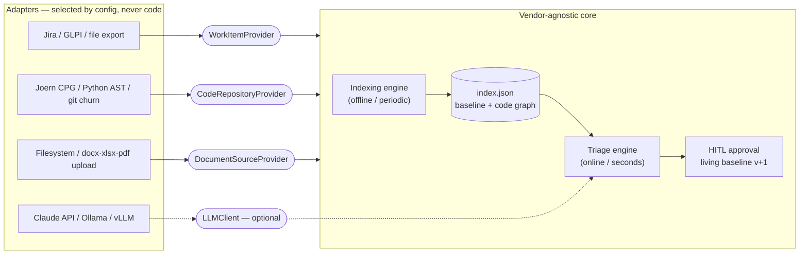

# Concepts

The design decisions that everything else hangs off. If you contribute to the engine,
these are the invariants to preserve.

## The evidence chain

Every triage decision is emitted with a full, frozen **evidence chain**:

- the contract clauses checked, and the best match with its similarity score,
- the **cited clauses in full text**, frozen at decision time (a later contract change
  cannot silently rewrite the basis of an old decision),
- the impacted code modules with their metrics (size, complexity, churn),
- source coverage (which of spec/code/history were available) and the assumptions made
  for missing sources,
- reasoning, confidence, the **model/prompt version** and an **index-freshness stamp**.

The point is auditability: months later, in a contractual dispute, any decision can be
reconstructed exactly as it was made. Reviewer actions (approve/reject/convert-to-CR,
overrides) append to an immutable audit trail on top.

## The two-evidence rule

A confident decision rests on **two independent kinds of evidence**:

1. **Text similarity** — does the request match a contract clause?
2. **Code reality** — does the request touch code that is already in scope?

Agreement → high confidence. Conflict or weakness → **gray area → escalate to a human reviewer**.
The decision-tree order is: maintenance scope → explicit EXCLUDED match → code+text
match → limit/quota check → effort-pool check → otherwise CR candidate.

## EXCLUDED scope is first-class

Scope items carry a polarity: `INCLUDED | EXCLUDED`. Contracts don't only say what's in
scope — they explicitly say what's *out* ("SSO integration is out of scope"). A match
against an EXCLUDED clause is the **highest-confidence out-of-scope decision** there is,
and it cites the exact exclusion clause. Never collapse polarity into a boolean.

## Estimates are ranges, never single numbers

Single-point estimates are forbidden by design (cone of uncertainty). Every estimate is
a **three-point/PERT range with its basis**: *"12–18h; 3 modules, one high-churn; 2
similar past tickets at 14h/16h"*. Historical effort feeds this by analogy through the
normalized `effort_seconds` of past work items; when no history is reachable, estimation
degrades gracefully to code metrics.

## Two cadences

- **Indexing** is offline/periodic: parse contracts → scope baseline; parse code →
  module graph (Joern CPG or the dependency-free Python AST path — same normalized
  schema). Heavy work lives here.
- **Triage** is online and answers in seconds by querying the pre-built index. Every
  decision is stamped with the index build date, because a stale index means wrong
  impact analysis.

## The living baseline

An approved Change Request appends a new scope item and **bumps the baseline version**.
Later requests are judged against the expanded scope. The approved baseline is
single-sourced in the database and survives restarts and re-indexing.

## Copilot, not autopilot

The system only **recommends**; a human makes the final call (the `pmo` role approves). When the reviewer overrides the system's
recommendation, the override is recorded — both for auditability and as an
**over-reliance metric** on the KPI dashboard. Pilot mismatches feed a calibration loop
that *suggests* threshold changes; a human applies them.

## Decision memory is a projection

Decisions are also written to a per-project **markdown wiki** (searchable long-form
memory: decision pages, entity backlinks, precedents from human overrides, a disputed-
clauses page). The load-bearing rule: the wiki is **always a projection of the
database** — one writer, regenerable bit-identically with `python -m etki.wiki
rebuild`, never hand-edited, and a wiki failure never breaks triage. Retrieval over
the same knowledge (top-k, graph expand, guarded NL query) goes through a single
`GraphQueryPort`, and what it returns is **context, never a decision signal**.
Details: [Decision memory](memory.md).

## Hexagonal architecture

The core is vendor-agnostic: it talks only to abstract ports (`WorkItemProvider`,
`CodeRepositoryProvider`, `DocumentSourceProvider`, optional `LLMClient`). Which adapter
is active is **configuration, never code** — see [Writing an adapter](writing-an-adapter.md).

## How matching works today (honestly)

Request↔contract matching is layered, and every layer is measured on
[EtkiBench](https://github.com/yasinyaman/etki/blob/master/eval/datasets/etkibench/README.md):

1. **Deterministic lexical matching** (always on): tokenization with a Turkish↔English
   domain-term bridge, prefix-based inflection tolerance, bilingual
   stopword/boilerplate filtering, and a symmetric-normalized overlap score guarded
   against short-query inflation. 62% benchmark agreement, fully reproducible.
2. **Deterministic semantic evidence** (optional, local embeddings): an
   `EmbeddingProvider` port over any OpenAI-compatible endpoint. Measured limitation:
   cosine similarity cannot tell *"a paraphrase of a clause"* from *"a new capability
   near a clause"* — so by design this layer only routes **clear exclusion matches**
   (strong cosine with a dominance margin, counted as second evidence) and otherwise
   records an informational "semantically nearest clause" note. It never fabricates an
   in-scope call.
3. **Guarded LLM assist** (optional, off by default): consulted only on weak
   deterministic matches; strength-gated, whitelist-validated, with explicit
   anti-hallucination rules. This is where paraphrase judgment lives — it lifts the
   benchmark to 88% with a local **20B** model (English prompts, 2026-07), and the
   guards exist because an unguarded small model measurably made results *worse*.
4. **Cross-encoder reranker lane** (optional, `ETKI_RERANK_BASE_URL`,
   TEI-compatible, bge-reranker-v2-m3): reads the (request, clause) pair jointly —
   the only measured mechanism that separates *paraphrase-of-a-clause* from
   *new-capability-near-a-clause* deterministically (AUC 0.975). Alone it lifts the
   deterministic benchmark 68% → 80% with ~90 ms latency and no LLM; combined with a
   20B model, 94%. Honest caveat: on the frozen golden set the same lane costs 4
   adversarial cases (61 → 57/66), so it ships **opt-in** until the strength
   threshold is recalibrated on a dev set — never against the golden answer key.
